# Dataflow and Pipeline Diagrams

Dataflow and pipeline diagrams for the base stack and each docker compose
profile. All diagrams are [Mermaid](https://mermaid.js.org/) and render directly
on GitHub.

## Base Stack (`docker compose up -d`)

The setup service generates a CA and TLS certificates into the shared `certs`
volume, then the 3-node Elasticsearch cluster, Kibana, and Fleet Server (which
also provides the APM server) come online. All connections are TLS.

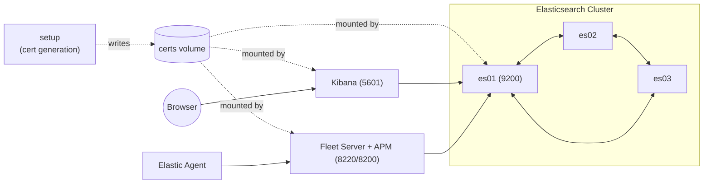

## Machine Learning Profile (`--profile ml`)

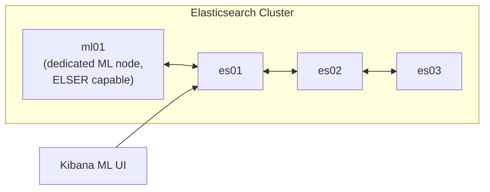

## Frozen Tier Profile (`--profile frozen`)

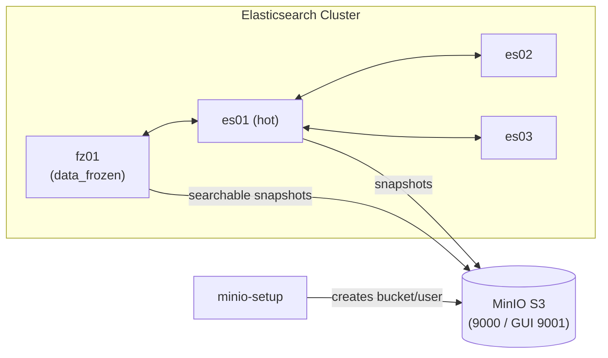

## Monitoring Profile (`--profile monitoring`)

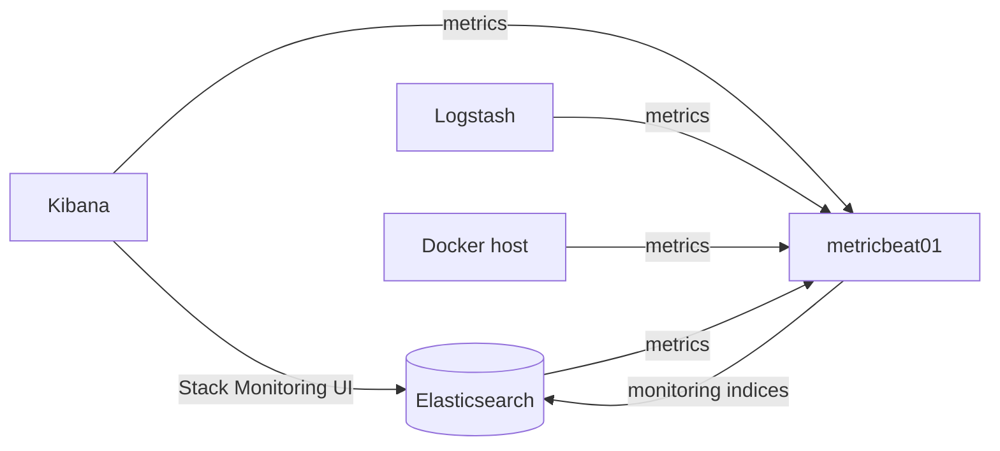

## Filebeat Profile (`--profile filebeat`)

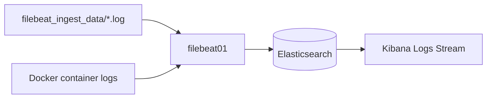

## Logstash Profile (`--profile logstash`)

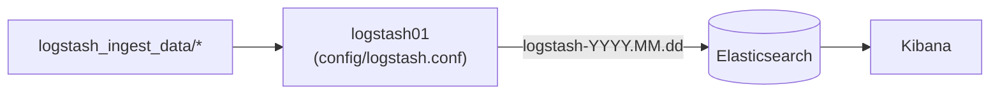

## APM Profile (`--profile apm`)

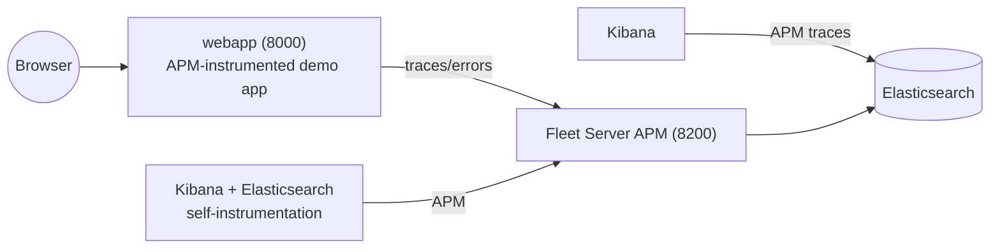

## Agent Profile (`--profile agent`)

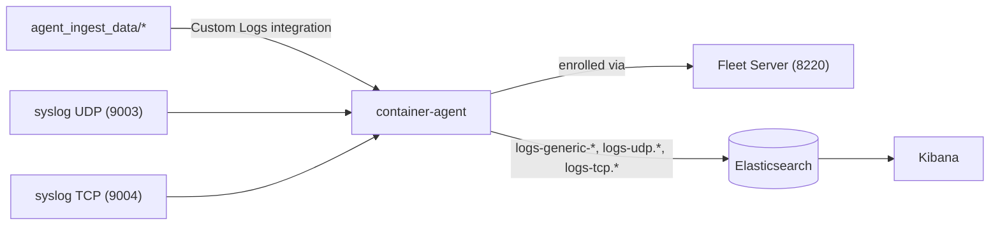

## Kafka Profile (`--profile kafka`)

Dual Logstash pipeline with a TLS-secured Kafka broker (KRaft, no Zookeeper).
The broker certificate is issued from the stack CA by the setup service.

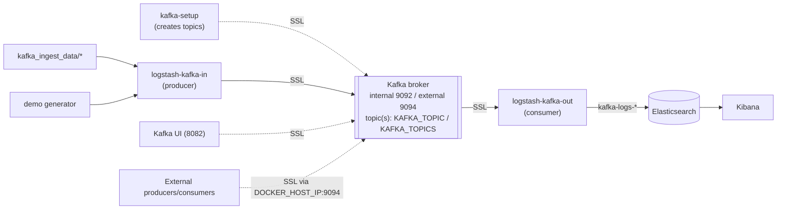

## MCP Profile (`--profile mcp`)

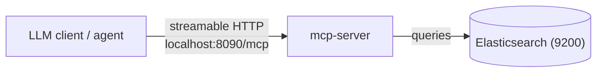

## Air-Gapped Deployment (`-f air-gapped.yml`)

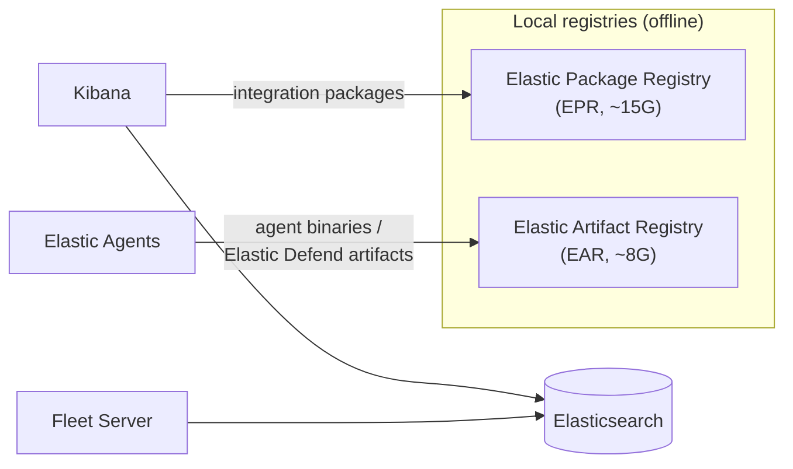

## Elastic Maps Server (`-f elastic-maps-server.yml`)

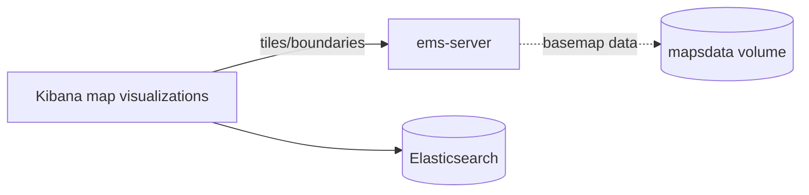

## Certificate / TLS Trust Flow

Every service trusts every other service through the single CA in the shared
`certs` volume (self-generated by default, or externally provided).

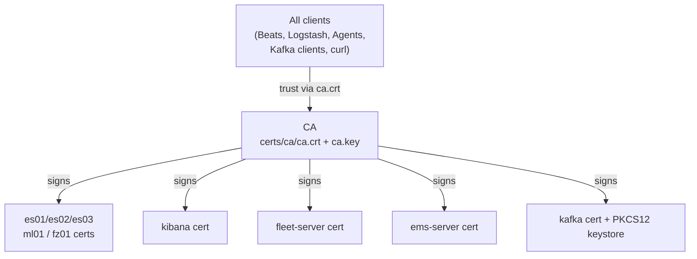
